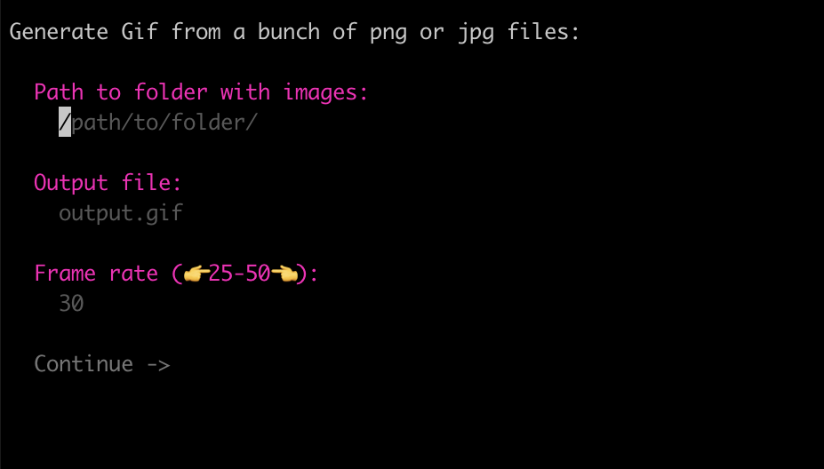

# png2gif

Small CLI tool to convert a sequence of `.png` or `.jpg` images to an animated`.gif`.

## Install

Download the latest release from the [releases page](https://github.com/egor-romanov/png2gif/releases) for your platform. You may need to make the file executable and allow your MacOS to run it. See [this guide](https://support.apple.com/en-gb/guide/mac-help/mh40616/mac) for more information.

### Or build from source

Clone the repo, then run `go build` in the root directory.

Don't forget to add the binary to your path.

## [Try it out](https://replit.com/@egor-romanov/animations)

Just fork a project on replit: https://replit.com/@egor-romanov/animations

## Usage

```bash
png2gif
```



You will be prompted to select a folder containing the images to generate the gif from. The images should be named in the order you want them to appear in the gif.

Example:

```bash
001.png
002.png
003.png
...
```

## Credits

It uses [bubbletea](github.com/charmbracelet/bubbletea) for the UI. And [images4](github.com/vitali-fedulov/images4) to compare consecutive images to determine if they are the same. This is to avoid adding duplicate frames to the gif and save a bit of size.

## Example

I generated code animation with [motioncanvas.io](https://motioncanvas.io), then, used its editor to render it as a sequence of images. Which was then passed to this CLI to get this gif.


